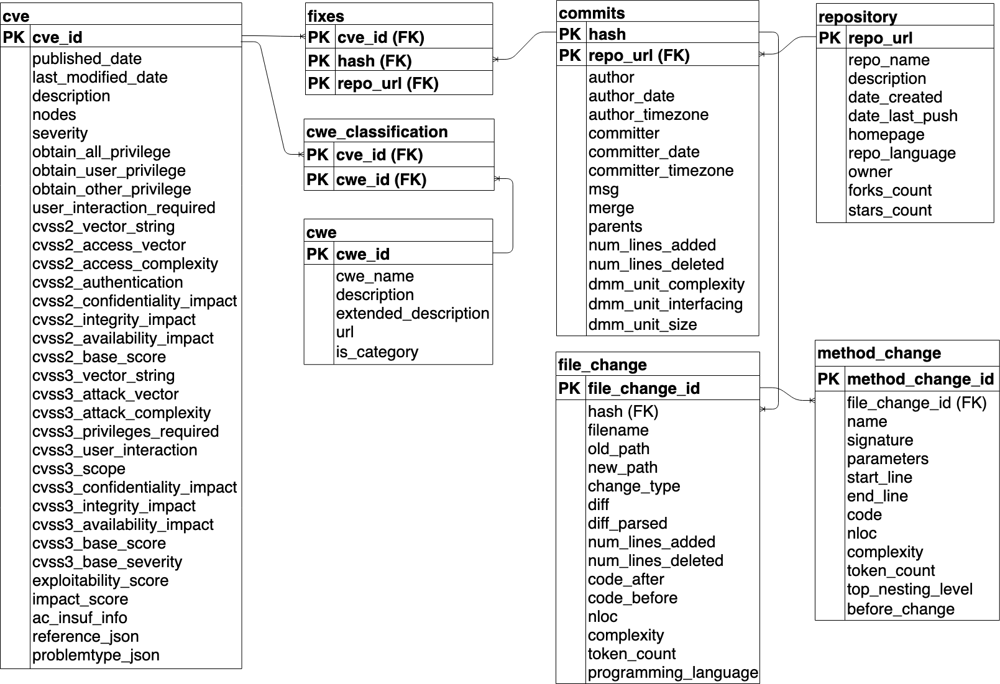

# Data Dictionary for *CVEfixes*

The *CVEfixes* dataset is structured as a relational database consisting of multiple tables where each table 
presents artifacts at each specific abstraction level. The following figure shows how the tables are organized and connected:

The sections below present the details of each of the columns in the tables:

* [cve](#cve)
* [fixes](#project)
* [commits](#commits)
* [repository](#repo)
* [file\_change](#file\_change)
* [method\_change](#method\_change)
* [cwe\_classification](#cwe\_classification)
* [cwe](#cwe)

**Sources of information**: The CVE records were obtained from the [U.S. National Vulnerability Database (NVD)](https://nvd.nist.gov/), 
The commits were extracted from the respective projects repositories on GitHub, Gitlab or Bitbucket, 
and several of the code level metrics were extracted using [PyDriller 2.0](https://pydriller.readthedocs.io/en/latest/).

## cve

|columns                        |description                                                |Links               |
|-------------------------------|-----------------------------------------------------------|--------------------|
|cve\_id                         |A unique identifier assigned to Common Vulnerability and Exposures (CVE)             |https://cve.mitre.org/cve/cvrf.html               |
|published\_date                 |Published date of the CVE Entry to CVE database                             |                                                  |
|last\_modified\_date             |The last date that the CVE Entry's description or references were modified           |                                                  |
|description                     |Short description of CVE record    |                                                  |
|nodes                           |The operating system software and versions where the vulnerability was occurred                                      |                                                  |
|severity                       |The numeric measure of severity level ranges from 0 to 10                                            |https://www.first.org/cvss/specification-document |
|obtain\_all\_privilege           |True' if attacker get all the privileges to attack on remote data else 'False'                             |                                                  |
|obtain\_user\_privilege          |True' if attacker get user privilege to attack on remote data else 'False'                               |                                                  |
|obtain\_other\_privilege         |True' if attacker get other privilege to attack on remote data else 'False'                              |                                                  |
|user\_interaction\_required      |The value is 'True' if user interaction is required else 'False'                                         |                                                  |
|cvss2\_vector\_string          |Textual representation of the CVSS Base and Temporal scores, for eg.- AV:N/AC:L/Au:N/C:N/I:N/A:P                  |https://www.first.org/cvss/v2/guide               |
|cvss2\_access\_vector          |The metric tells how the vulnerability is exploited, i.e., Local(L)/Adjacent Network(A)/Network(N)              |https://www.first.org/cvss/v2/guide               |
|cvss2\_access\_complexity      |The complexity of the attack required to exploit the vulnerability once an attacker has gained access to the target system, i.e. High/Medium/Low               |https://www.first.org/cvss/v2/guide               |
|cvss2\_authentication         |This metric measures the number of times an attacker must authenticate to a target in order to exploit a vulnerability, possible values - Multiple/Single/None |https://www.first.org/cvss/v2/guide               |
|cvss2\_confidentiality\_impact |This metric measures the impact on confidentiality of a successfully exploited vulnerability - Complete/Partial/None                      |https://www.first.org/cvss/v2/guide               |
|cvss2\_integrity\_impact       |This metric measures the impact to integrity of a successfully exploited vulnerability - Complete/Partial/None                 |https://www.first.org/cvss/v2/guide               |
|cvss2\_availability\_impact    |This metric measures the impact to availability of a successfully exploited vulnerability - Complete/Partial/None                    |https://www.first.org/cvss/v2/guide               |
|cvss2\_base\_score             |CVSS v2.0 Base Score ranges from 0 to 10 and the severity  is categorized as Low, Medium and High                          |                                     |
|cvss3\_vector\_string          |Textual representation of the CVSS Base and Temporal scores                                                  |                                                  |
|cvss3\_attack\_vector          |The metric tells how the attack is exploited, i.e., Local(L)/Adjacent Network(A)/Network(N)                      |https://www.first.org/cvss/v3.0/user-guide        |
|cvss3\_attack\_complexity      |Attack complexity is a metric that combines CVSSv2 attack complexity and user interaction                      |https://www.first.org/cvss/calculator/3.0         |
|cvss3\_privileges\_required    |Level of access required for a successful attack- High/Low/None, this metric replaces cvssV2\_authentication         |                                                  |
|cvss3\_user\_interaction       |This metric measures the user interaction needed to attack, i.e., None/Required           |                                                  |
|cvss3\_scope                  |impact affects systems beyond the exploitable component - Unchanged/Changed                        |                                                  |
|cvss3\_confidentiality\_impact |This metric measures the impact on confidentiality of a successfully exploited vulnerability - High/Low/None               |                                                  |
|cvss3\_integrity\_impact       |This metric measures the impact to integrity of a successfully exploited vulnerability - High/Low/None           |                                                  |
|cvss3\_availability\_impact    |This metric measures the impact to availability of a successfully exploited vulnerability - High/Low/None         |                                                  |
|cvss3\_base\_score             |CVSS v3.0 Base Score ranges from 0 to 10 and the severity  is categorized as None, Low, Medium, High and Critical   |                                                  |
|cvss3\_base\_severity          |This metric measures the base severity in numerical value   |             |
|exploitability\_score             |Exploitability metric is calculated using attack vector, attack complexity, user interaction and scope      |                                                  |
|impact\_score                     |This is an impact metric of the vulnerability calculated from confidentiality impact, integrity impact and availability impact     |                                                  |
|ac\_insuf\_info                   |Insufficient Information type - True/False               |                                                  |
|reference\_json                   |A raw JSON of the list of reference(s) to the vulnerability                                             |                                                  |
|problemtype\_json                 |The description of the vulnerability type, i.e, a raw JSON field to the CWE(s) and consists with the dictionary of the list of CWE and language.    | | 

## fixes

|columns   |description                                                              |
|----------|-------------------------------------------------------------------------|
|cve\_id    |A unique identifier assigned to Common Vulnerability and Exposures (CVE) |
|hash       |The unique identifier to commit                                          |
|repo\_url  |URL of the repository                                                    |

## repository

|columns        |description            |
|---------------|--------------------------------------------------------|
|repo\_url       |URL of the repository                                   |
|repo\_name      |Name of the repository - organization/project           |
|description    |Short description of repository                         |
|date\_created   |Date of repository creation, e.g., 2013-10-25 18:26:45  |
|date\_last\_push |Date of last push into repository                       |
|homepage       |Homepage of repository                                  |
|repo\_language  |Language used in repository                            |
|owner          |Owner of the repository                                |
|forks\_count    |Number of forks                                        |
|stars\_count    |Number of stars                                        |

## commits

|columns              |description                                    |
|---------------------|-----------------------------------------------------|
|hash                 |The unique identifier for git commit               |
|repo\_url            |URL of the repository                                                    |
|author               |Name of the commit author                                |
|author\_date          |Date of the authored, for eg., 1999-11-10 02:42:49+00:00 |
|author\_timezone      |Timezone of the author                              |
|committer            |Name of the committer/developer who pushed the commit    |
|committer\_date       |Date of the commit                |
|committer\_timezone   |Timezone of the commit   |
|msg                  |Commit message                         |
|merge                |The value is positive if the commit is merge, otherwise zero        |
|parents              |List of parents of this commit         |
|num_lines_added      |Number of added lines                  |
|num_lines_deleted    |Number of deleted lines                |
|dmm\_unit\_complexity  |Delta Maintainability Model (DMM) complexity is a cyclomatic complexity metric which is the proportion of low-risk change in a commit with threshold 5. Formula :- DMM value = good change / (good change + bad change) |
|dmm\_unit\_interfacing |DMM interfacing is the metric value for unit interfacing property on number of parameters at low risk threshold 2                    |
|dmm\_unit\_size        |Metric of method length in lines of code at low risk threshold 15 lines    |

## file\_change

|columns              |description                                                |
|---------------------|-----------------------------------------------------------|
|file\_change\_id     |Primary key for the table                                  |
|hash                 |The unique identifier for git commit                       |
|filename             |Name of of the file                                         |
|old\_path             |Old path of the file or 'None' if the file is new          |
|new\_path             |New path of the file or 'None' if the file is deleted      |
|change\_type          |Type of change, i.e., MODIFY/ADD/DELETE/RENAME             |
|diff                 |Git diff between files in two commits                      |
|diff\_parsed          |The dictionary contains added and deleted lines, for e.g., {'added': [(973, 'iakerb\_gss\_import\_sec\_context,')], 'deleted': [(973, '    NULL,')]} |
|code\_after           |Source code after the commit or 'None' if the file is deleted/renamed       |
|code\_before          |Source code before the commit refers vulnerable code or 'None' if the file is added/renamed  |
|nloc                 |Number of lines in the file                              |
|complexity           |Cyclomatic complexity metric of the file, i.e. a qualitative measure of linearly independent paths in code    |
|token\_count          |Number of tokens in code                           |
|programming\_language |Programming language of source code         |
|num_lines_added       |Number of lines added to the file                                |
|num_lines_deleted     |Number of lines removed from the file                              |

## method\_change

|columns              |description                 |
|---------------------|---------------------------------------------------|
|method\_change\_id   |Primary key for the table                       |
|file\_change\_id     |Foreign key to 'file_change' table                      |
|name                 |Name of the method/function                      |
|signature            |Name of the method including parameters' name and type|
|parameters           |List of method parameters                    |
|start\_line           |Start line of the method in the file           |
|end\_line             |End line of the method in the file                     |
|code                 |Source code  of the method                   |
|nloc                 |Number of lines in the method                |
|complexity           |Cyclomatic complexity metric of the method, i.e. a qualitative measure of linearly independent paths in code  |
|token\_count          |Number of tokens in method                   |
|top\_nesting\_level   |Top nesting level                            |
|before\_change       | Vulnerable or not (True/False)             |

## cwe\_classification

This table is for the association in between _cwe_ and _cve_ table.

|columns     |description                                               |
|------------|----------------------------------------------------------|
|cve\_id      |A unique identifier assigned to Common Vulnerability and Exposures (CVE) |
|cwe\_id      |Common Weakness Enumeration (CWE) of the vulnerability |

## cwe

This table covers the [Common Weakness Enumeration (CWE)](https://cwe.mitre.org/) types used to classify CVE records.

|columns     |description                                               |
|------------|----------------------------------------------------------|
|cwe\_id      |CWE (Common Weakness Enumeration)-ID of the vulnerability |
|cwe\_name    |Name of the CWE vulnerability type                        |
|description |Short description of the CWE                               |
|extended_description  |Extended description of the CWE                  |
|url          |URL of the CWE for further detail information             |
|is_category  |Boolean value TRUE for category type CWE else FALSE       |
